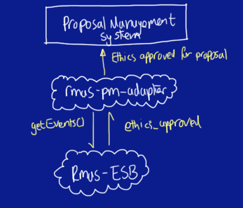

.. RMAS-Proposal Management adapter documentation master file, created by
   sphinx-quickstart on Thu Dec 20 12:38:31 2012.
   You can adapt this file completely to your liking, but it should at least
   contain the root `toctree` directive.

Welcome to RMAS-Proposal Management adapter's documentation!
============================================================

The rmas-proposal-management-adapter is a key component in a proof of concept for integtrating `OpenEthics <https://github.com/UoK-Psychology/Openethics>`_
into the RMAS framework. The video below demonstrates this proof of concept, and explains how it works:

.. raw:: html

	<iframe src="http://player.vimeo.com/video/54785771?badge=0" width="500" height="281" frameborder="0" webkitAllowFullScreen mozallowfullscreen allowFullScreen></iframe> 
<a href="http://vimeo.com/54785771">RMAS-EE end to end demo</a> from <a href="http://vimeo.com/user14275825">Jason Marshall</a> on <a href="http://vimeo.com">Vimeo</a>.

The functions specific to the RMAS-proposal-management-Adapter can be summarized by the diagram below:

This adapter is much simpler than the RMAS-OpenEthics-adapter that is metnioned in the screencast.

It only has one role, which is to listen out for ethics_approved messages from the RMAS bus,
 and in response to receiving one, use the RMAS federated identifier contained within the message 
 to locate the proposal in the proposal managemenr system, and update its ethics approved status to 
 approved.
 
Additional documentation
=========================

.. toctree::
   :maxdepth: 1
   
   install_instructions
   api/modules
